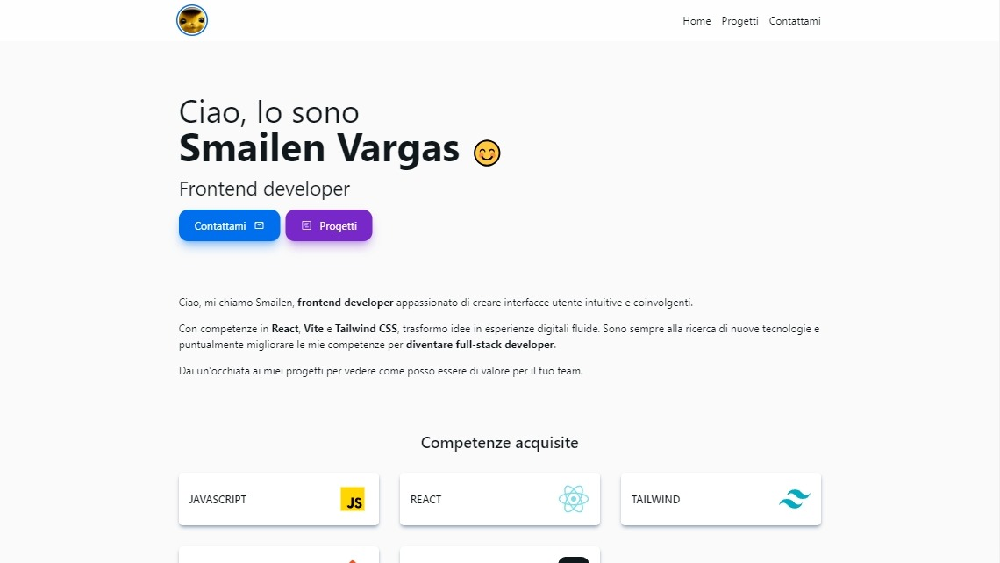
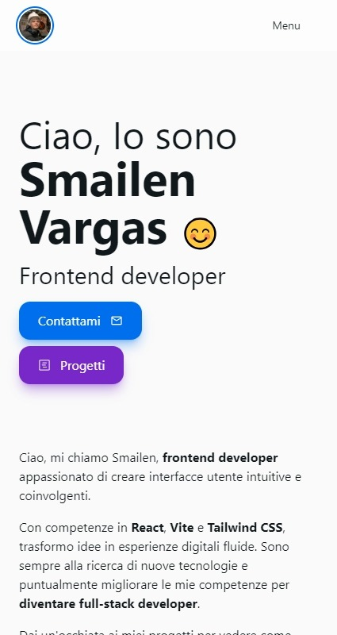

<div align="center">

# Smailen Vargas — Frontend Developer

**React · TypeScript · Full-Stack & Linux Systems**

A modern, type-safe portfolio built from scratch: file-based routing, per-route SEO, a single dark theme with no flash of unstyled content, and a clean atomic-design codebase.

[**Visit the website**](https://smailenvargas.com) · [Changelog](CHANGELOG.md) · [Report a bug](https://github.com/Smailen5/portfolio-website/issues) · [🇮🇹 Italiano](README.it.md)

[](https://app.netlify.com/sites/smailenvargas/deploys)


</div>

## Overview

This is my personal portfolio and frontend showcase. It presents selected projects, the technologies I work with and my background, plus a direct channel for collaboration.

The project has been maintained since 2024 and is built with the same stack I use in production work: **React 18**, **TypeScript in strict mode**, **TanStack Router** and **Tailwind CSS v4**. Every route is type-safe, metadata is generated per page, and project data is consumed from a self-hosted REST API.

## Screenshots

<details>
<summary>Desktop view (2024)</summary>

</details>

<details>
<summary>Mobile view (2024)</summary>

</details>

## Tech Stack

| Area            | Technology                              | Notes                                                                       |
| --------------- | --------------------------------------- | --------------------------------------------------------------------------- |
| UI              | React 18                                | Function components and hooks only                                          |
| Language        | TypeScript 5.9                          | `strict` mode, no `any`                                                     |
| Routing         | TanStack Router 1.x                     | Type-safe, file-based routing with per-route `head` metadata                |
| Styling         | Tailwind CSS v4 + DaisyUI 5             | Utility-first CSS with a single custom dark theme                           |
| Build tool      | Vite 7                                  | Fast dev server and optimized production build                              |
| Package manager | pnpm 9.14.2                             | Version pinned through `corepack`                                           |
| Code quality    | ESLint 9, Prettier 3, Husky, commitlint | Flat ESLint config, Prettier with the Tailwind plugin, conventional commits |
| Hosting         | Netlify                                 | Static build served from the CDN                                            |

## Features

- **Type-safe file-based routing** — routes live in `src/routes/` and are generated from the file system by the TanStack Router plugin. No manual route registry, no broken links.
- **Per-route SEO** — titles, descriptions, keywords, Open Graph tags and JSON-LD (Person schema) are generated through TanStack Router's native `head` API. No third-party SEO library is involved.
- **Dark-only theme without flicker** — `data-theme="dark"` is set directly in the HTML entry point. There is no theme toggle and no `localStorage`, so there is never a flash of the wrong theme on load.
- **Project catalogue with live filtering** — projects are fetched from a REST API and filtered by technology with a real-time counter.
- **Resilient data layer** — an in-memory cache with a 5-minute stale time avoids redundant requests, in-flight requests are cancelled with `AbortController`, and the UI exposes loading skeletons and an error state with a retry action.
- **Atomic Design structure** — components are organized into `atoms/`, `molecules/` and `organisms/`, with vertical feature slices for `projects/` and `cv/`.
- **Responsive and accessible** — layouts adapt from mobile to desktop, with semantic landmarks, `aria` labels and screen-reader-only headings.
- **Custom 404 page** for unknown routes.

## Getting Started

### Requirements

- **Node.js 22+**
- **pnpm 9.14.2**, enabled through corepack

```bash
corepack enable
```

### Installation

```bash
pnpm install
```

### Development

```bash
pnpm dev
```

The Vite dev server starts with `--host`, so it is also reachable from other devices on your local network.

### Available scripts

| Script            | Description                                          |
| ----------------- | ---------------------------------------------------- |
| `pnpm dev`        | Start the Vite dev server                            |
| `pnpm build`      | Create the optimized production build in `dist/`     |
| `pnpm preview`    | Preview the production build locally                 |
| `pnpm lint`       | Run ESLint                                           |
| `pnpm lint:fix`   | Run ESLint with autofix                              |
| `pnpm format`     | Check formatting with Prettier                       |
| `pnpm format:fix` | Apply Prettier formatting                            |
| `pnpm typecheck`  | Type-check the app and node configurations           |
| `pnpm check`      | Full quality gate: lint → format → typecheck → build |

### Environment variables

Copy `.env.example` to `.env.development` and/or `.env.production`. The only variable consumed by the application is:

| Variable       | Description                                       |
| -------------- | ------------------------------------------------- |
| `VITE_API_URL` | Base URL of the REST API that serves the projects |

## Project Structure

```text
src/
├── routes/       # File-based routes: thin wrappers with createFileRoute + head metadata
├── pages/        # Real page components (home, about, contact, project)
├── components/   # Atomic Design: atoms/ · molecules/ · organisms/
├── features/     # Vertical slices: cv/ · projects/
├── shared/       # constants/ · hooks/ · types/ · utils/
├── data/         # Static data (skills, social links, asset imports)
└── styles/       # Tailwind entry point and DaisyUI theme (app.css)
```

- The import alias **`@/*`** always points to `./src/*`.
- `src/routeTree.gen.ts` is generated by `@tanstack/router-plugin` during dev and build: never edit it by hand.
- Routes stay thin and delegate rendering to `src/pages/*`; the actual logic lives in `pages/`, `features/` and `components/`.

## Code Quality & CI

```bash
pnpm check
```

This runs ESLint, Prettier, TypeScript and a production build in sequence, and it is the gate to run before every commit.

- **Conventional Commits** are enforced by `commitlint` through a Husky `commit-msg` hook.
- A Husky `pre-push` hook runs `lint` and `format`.
- **CI** runs on pull requests targeting `main` and `v[0-9]*`: it installs dependencies with pnpm, then runs `lint → format → typecheck → build`, and validates that the PR title follows the Conventional Commits format (max 72 characters).

## Deployment

The site is a static build deployed on **Netlify**:

```bash
pnpm build          # output in dist/
netlify deploy      # draft deploy
netlify deploy --prod
```

Releases are automated with **release-please** on `main`.

## Ecosystem

The frontend is a static SPA. Project data is served by a self-hosted REST API (`VITE_API_URL`) running on a home **Proxmox VE** node through **LXC** containers, while static assets are delivered by the **Netlify CDN**.

**Backend repository:** [Smailen5/server-portfolio](https://github.com/Smailen5/server-portfolio)

## Contact

- **Website:** [smailenvargas.com](https://smailenvargas.com)
- **Email:** [job@smailenvargas.com](mailto:job@smailenvargas.com)
- **GitHub:** [@Smailen5](https://github.com/Smailen5)
- **LinkedIn:** [smailen-vargas](https://www.linkedin.com/in/smailen-vargas/)
- **Frontend Mentor:** [@Smailen5](https://www.frontendmentor.io/profile/Smailen5)

## License

© 2024-2026 Smailen Vargas. All rights reserved.

This repository is published for portfolio and demonstration purposes only. No permission is granted to copy, modify, redistribute or reuse the code, in whole or in part, without prior written consent. See [LICENSE](LICENSE) for the full text.
